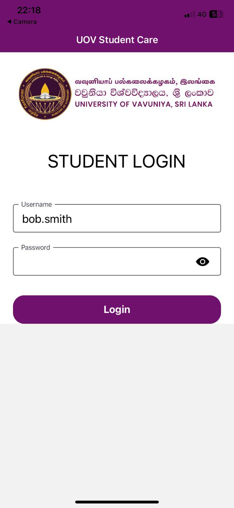
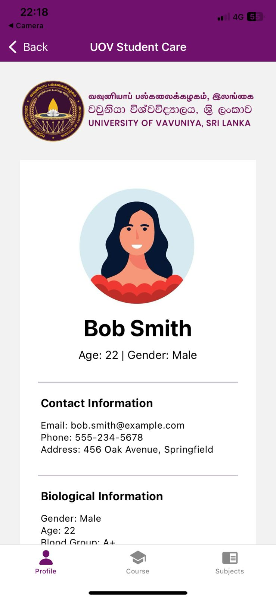
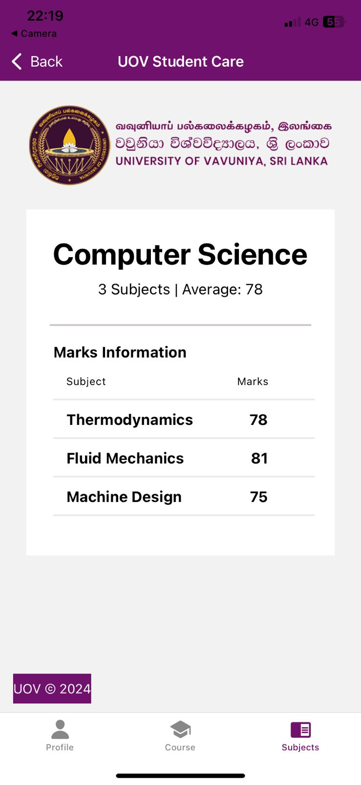

# Student Care App - University of Vauniya

## Overview
The Student Care App is designed to support students at the University of Vauniya by providing features to manage their academic and personal well-being. This app focuses on creating a user-friendly interface and offering tools for academic tracking, counseling appointments, events, and notifications.

## Features
- **Profile Management**: Students can create and update their profiles.
- **Academic Tracker**: Keep track of courses, grades, and academic progress.
- **Event Calendar**: View university events, workshops, and deadlines.
- **Counseling Appointments**: Schedule and manage counseling sessions.
- **Notifications**: Stay updated with alerts for events and announcements.
- **Resource Hub**: Access study materials, guides, and university resources.

## Technologies Used
- **Frontend**: React Native for cross-platform mobile app development.
- **Backend**: Node.js with Express.js for API handling.
- **Database**: MongoDB for storing user data and app-related information.
- **Authentication**: Firebase Authentication for secure login and user management.

## Setup Instructions
1. **Clone the Repository**:
   ```bash
   git clone https://github.com/Mobile-Communication-ComputingIT3133/student-care-app.git
   cd careapp
   ```
2. **Install Dependencies**:
   ```bash
   npm install
   ```

3. **Run the Development Server**:
   ```bash
   npm start
   ```
4. **Build the App**:
   For Android:
   ```bash
   npm run android
   ```
   For iOS:
   ```bash
   npm run ios
   ```

## Folder Structure
```
student-care-app/
├── src/
│   ├── components/    # Reusable UI components
│   ├── screens/       # App screens (e.g., Login, Dashboard, Profile)
│   ├── services/      # API calls and utility functions
│   └── assets/        # Images and static files
├── .env               # Environment variables
├── package.json       # Dependencies and scripts
└── README.md          # Project documentation
```

## Data Requirements
Ensure that the following data is prepared for the app:
- **Student Data**: Name, ID, contact details, academic info.
- **Event Data**: Event title, description, date, and location.
- **Counseling Data**: Availability of counselors, appointment schedules.

## Images
Place the provided images in the `src/assets/images/` folder. Refer to them using relative paths in your components.

## Contribution Guidelines
1. Fork the repository and create your feature branch:
   ```bash
   git checkout -b feature/your-feature
   ```
2. Commit your changes:
   ```bash
   git commit -m "Add your message here"
   ```
3. Push to the branch:
   ```bash
   git push origin feature/your-feature
   ```
4. Open a Pull Request on GitHub.

## License
This project is licensed under the [MIT License](LICENSE).

## Contact
For queries or support, please contact:
- **Name**: Kasun Rajapaksha
- **University**: University of Vauniya

---

## Outputs

**Login**


**Login with Password**


**Profile**


**Course**


**Subject**
